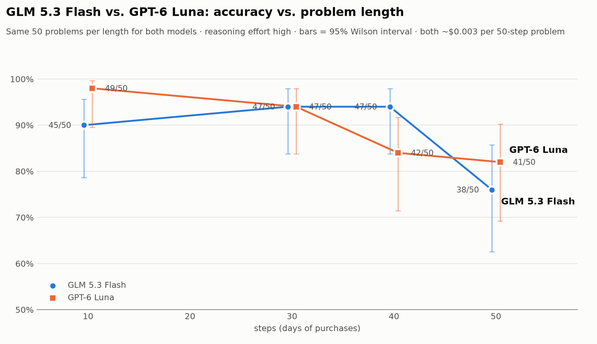
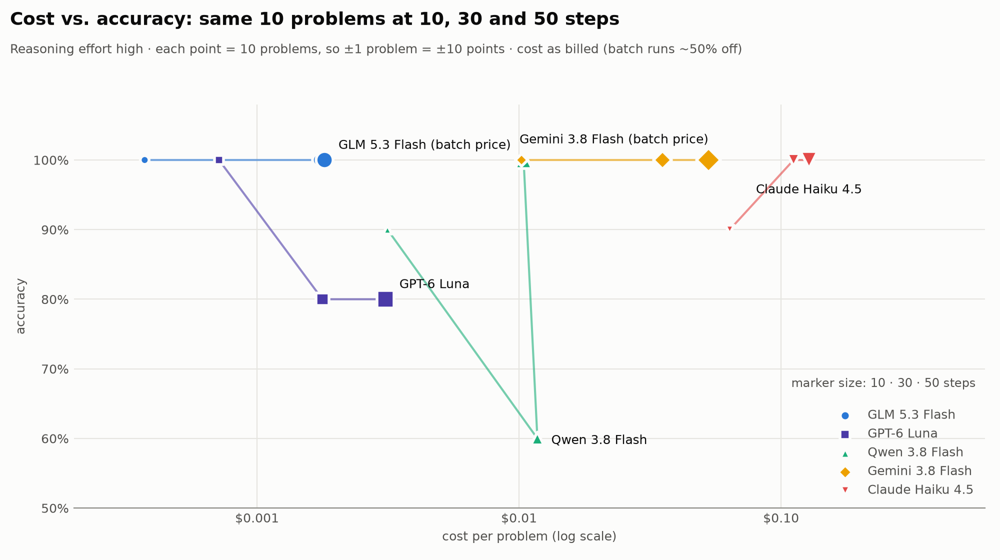

# Procedural Grade School Math

Generate grade school math word problems procedurally.

[Example](datasets/examples/price_normal.md)

# Results

## 2026



GLM 5.3 Flash and GPT-6 Luna perform very similarly, accuracy goes down with problem size.

We see in our analysis that:

1. Even these small models are very good at GSM problems. Accuracy is strong even at 50 step problems where humans would simply be driven mad by the problem.
2. The mistakes made were usually picking up the wrong numbers from context, eg 60% of the wrong answers picked up the price or quantity from the wrong day. This is a common needle-in-haystack issue.



We explored with many more models. Most models were very accurate but cost varied radically. Assuming most models are at similar capability, we continued fine grained experiments with cheapest models.

## 2024
From my informal tests, GPT-4 used to mess up even smaller problems. It had a bug where it would confuse `$` for a variable name. This was fixed in GPT 4.1.
DeepSeek R1 was able to solve big problems pretty well.
My guess was that big labs had GSM generators, though a open source version was missing. This inspired me to work on this project.

# How to run

Generate 10 problems with 5 rows:
```
python src/py/generate.py --N 5 --count 10 > file.jsonl
```

Generate 10 problems with 10 rows, in easy to read format:
```
python src/py/generate.py --N 10 --count 10 --easy-read > file.jsonl
```

Generate 1 problem with 5 rows, to read from stdout:
```
python src/py/generate.py --N 5 --count 1 --dump
```

## Problem type: Buying items with price and quantity.

1. Problem consists of a series of N statements, where quantity and price are given for purchase of an item each day. Increasing number of days increases complexity.
1. A few (at least one) quantity has actual numerical values. The rest of the quantities are expressed relative to other quantities. Eg: Monday quantity 5. Tuesday quantity is 5x that of Monday. Wednesday quantity is 10 more than Tuesday.
1. Same for price. One row can refer to different other rows for price and quantity. Eg Mondays quantity is 2x Tuesday, but price is 2/3 Wednesday.
1. There can be forward references. Eg: Monday is 5x Tuesday, Tuesday is 2x Wednesday, Wednesday is 5.
1. Model must calculate total money spent, or total is given and price or quantity on a certain day needs to be calculated.
1. Each number is given randomly as words, numbers, percentage etc to confuse the model. Eg: 5 items, five items, 5x items, five times items, 500% items.
1. Each quantity can always be easily determined simply by following the chain of dependencies. Algebra is not needed, though models sometimes use them to solve the problems.
1. To avoid approximation, quantities are always integers, and prices are always multiples of .25, .50 or .10. Fractions will adjust for this. If quantity is 6, a reference can be 3/2 of 6, but never 3/4 of 6. Same for price.

## Motivation

1. A recent paper by Apple pointed out even though most LLMs score very high on the GSM8K benchmark, some LLMs score badly by simply changing the numbers or names in the problems. This indicates overtraining on the GSM8K dataset.
2. Most larger LLMs were not affected, and most small LLMs have adjusted and no longer have the same vulnerabilities. However, the training data used to improve performance are proprietary, there is not many open source GSM datasets.
3. A tremendous number of problems can be potentially procedurally generated. While repetitive to humans, the variation in names, numbers, items, fact ordering etc might be able to improve training data.
4. LLMs can be tested on unique procedurally generated problems, similar to ARC.
5. Variations in problems can be finely controlled. Eg, we can easily generate problems with double or 10x the complexity.
6. Problem diversity is better with procedural generation than simply asking the LLM.
7. Procedural generation allows finer grained control of the dataset.
8. These problems can also be given to human students. Note that some problems might be difficult/annoying for human students to parse. Example: You bought twice as many cakes on Monday as Tuesday. You bought 20% more cakes on Tuesday than Wednesday. You bought 10 cakes on Wednesday. How many cakes in total did you buy?

## Analysis of GSM problems
[Analysis](Analysis.md)
